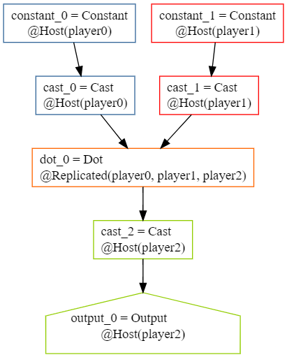
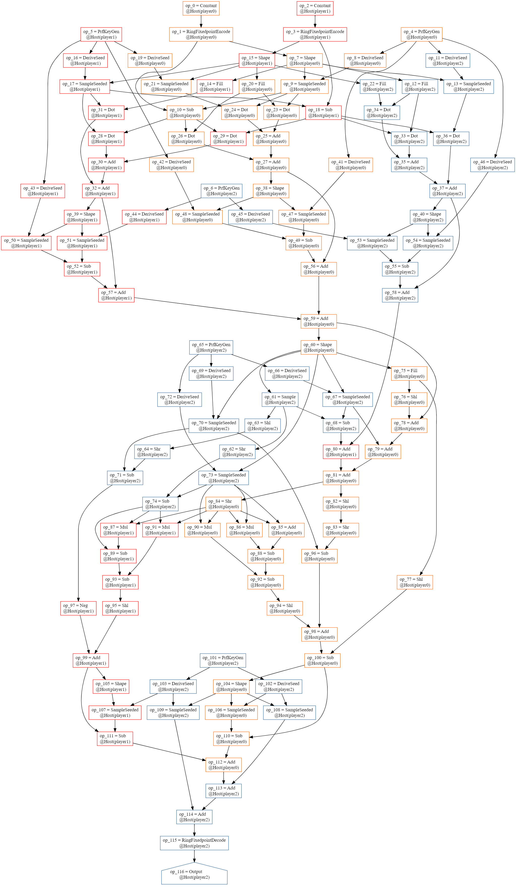
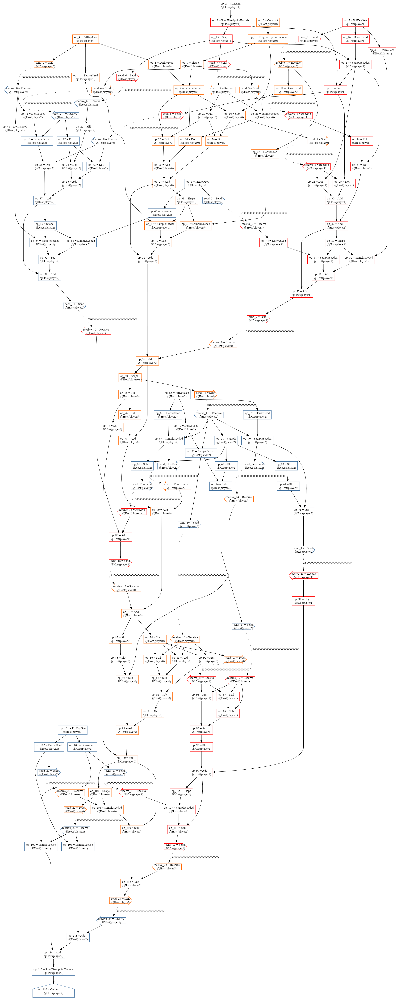

Using Moose with PyMoose Computations
==================
This example demonstrates how to convert an AbstractComputation in PyMoose (i.e. a pymoose function decorated with `pm.computation`) to its equivalent in textual form. The resulting text file can be used directly with [Moose command line tools](https://github.com/tf-encrypted/moose/tree/main/moose/src/bin) to analyze, compile, and evaluate computations.

<details>
<summary> Table of Contents </summary>
<ol>
    <li><a href="#generating-a-moose-computation-in-textual-form">Generating a Moose computation in textual form</a></li>
    <li><a href="#using-elk-to-compile-and-analyze-the-textual-form">Using Elk to compile and analyze the textual form</a></li>
    <ul>
        <li><a href="#using-elk-to-get-an-evaluation-ready-computation">Using Elk to get an evaluation-ready computation</a></li>
        <li><a href="#common-compilation-passes">Common compilation passes</a></li>
        <li><a href="#other-compilation-passes">Other compilation passes</a></li>
    </ul>
    <li><a href="#evaluating-the-textual-form-against-a-moose-runtime">Evaluating the textual form against a Moose runtime</a></li>
</ol>
</details>

## Generating a Moose computation in textual form

The Python program [`generate_dotprod.py`](./generate_dotprod.py) contains the following AbstractComputation `my_computation` that securely computes a dot-product between two public constants:
```python
FIXED = pm.fixed(24, 40)

@pm.computation
def my_computation():
    with player0:
        x = pm.constant(np.array([1., 2., 3.]).reshape((1, 3)))
        x = pm.cast(x, dtype=FIXED)
    with player1:
        w = pm.constant(np.array([4., 5., 6.]).reshape((3, 1)))
        w = pm.cast(w, dtype=FIXED)
    
    with repl:
        y_hat = pm.dot(x, w)

    with player2:
        result = pm.cast(y_hat, dtype=pm.float64)
    return result
```
(Note that using constants this way is not generally secure, since constants are embedded in the computation graph in plaintext. This is just a simple, pedagogical example of a replicated computation.)

The following function writes this high-level abstract computation into a text file at the location `filepath`:

```python
def comp_to_moose(filepath):
    traced_comp: pm.edsl.base.AbstractComputation = pm.trace(my_computation)
    comp_bin: bytes = utils.serialize_computation(traced_comp)
    rust_comp: pm.MooseComputation = pm.elk_compiler.compile_computation(comp_bin, passes=[])
    textual_comp: str = rust_comp.to_textual()
    with open(filepath, "w") as f:
        f.write(textual_comp)
```

Use of the `compile_computation` function here seems a bit strange. Since we are passing an empty list of compiler passes to run (`passes=[]`), this will be a no-op for the Elk compiler. But by using `compile_computation` we are implicitly marshaling the Python computation into its canonical Moose computation in Rust, since this function is actually a Rust binding. We get a `MooseComputation` object back, which is just a reference to the Rust-managed Moose computation.

This object has a few methods, including `to_textual()`, which parses the computation into its canonical string. We call this string the "textual form" or "textual representation" of a Moose computation. When computations in textual form are written to a file, we use the `.moose` extension by convention. Working with computations in textual form allows us to use them with the lower-level Moose and Elk machinery that the Moose command line tools offer, since those are built with the textual representation in mind.

## Using Elk to compile and analyze the textual form
Since we passed an empty list of compiler passes instead of using the default passes, this computation remains un-compiled, and its textual form reflects that:

```console
constant_0 = Constant{value = HostFloat64Tensor([[1.0, 2.0, 3.0]])}: () -> Tensor<Float64> () @Host(player0)
cast_0 = Cast: (Tensor<Float64>) -> Tensor<Fixed128(24, 40)> (constant_0) @Host(player0)
constant_1 = Constant{value = HostFloat64Tensor([[4.0], [5.0], [6.0]])}: () -> Tensor<Float64> () @Host(player1)
cast_1 = Cast: (Tensor<Float64>) -> Tensor<Fixed128(24, 40)> (constant_1) @Host(player1)
dot_0 = Dot: (Tensor<Fixed128(24, 40)>, Tensor<Fixed128(24, 40)>) -> Tensor<Fixed128(24, 40)> (cast_0, cast_1) @Replicated(player0, player1, player2)
cast_2 = Cast: (Tensor<Fixed128(24, 40)>) -> Tensor<Float64> (dot_0) @Host(player2)
output_0 = Output{tag = "output_0"}: (Tensor<Float64>) -> Tensor<Float64> (cast_2) @Host(player2)
```

For example, all our non-constant values in the computation have generic type `Tensor<T>` -- this is a higher-level type that is erased during the `Lowering` pass of Elk's default compilation. Another example is that our dot product is placed on the `@Replicated(player0, player1, player2)` placement. Replicated placements are virtual placements, meaning their operations will always have to be compiled into a series of operations against a concrete placement like `HostPlacement` before the computation can be evaluated against a Moose runtime.

First, let's run a lowering pass on our computation, to see what a compiled computation might look like:
```console
$ elk compile dotprod.moose --passes lowering
op_0 = Constant{value = HostFloat64Tensor([[1.0, 2.0, 3.0]])}: () -> HostFloat64Tensor () @Host(player0)
op_1 = RingFixedpointEncode{scaling_base = 2, scaling_exp = 40}: (HostFloat64Tensor) -> HostRing128Tensor (op_0) @Host(player0)
op_2 = Constant{value = HostFloat64Tensor([[4.0], [5.0], [6.0]])}: () -> HostFloat64Tensor () @Host(player1)
op_3 = RingFixedpointEncode{scaling_base = 2, scaling_exp = 40}: (HostFloat64Tensor) -> HostRing128Tensor (op_2) @Host(player1)
op_4 = PrfKeyGen: () -> HostPrfKey () @Host(player0)
... rest of output omitted ...
```

### Using Elk to get an evaluation-ready computation

Examining this compiled computation, we can see that all types are concrete, e.g. have the `Host` prefix, denoting that they are values owned by particular host devices. All operations are also pinned against HostPlacements; there are no more virtual placements. However, this computation is not yet ready for evaluation as we can see by examining the following two lines in the compiled output:
```console
op_7 = Shape: (HostRing128Tensor) -> HostShape (op_1) @Host(player0)
...
op_12 = Fill{value = Ring128(0)}: (HostShape) -> HostRing128Tensor (op_7) @Host(player2)
```
Taking this apart step-by-step, we can see that `op_7` evaluates the shape of a tensor located on `player0`, whereas `op_12` uses that shape to generate a tensor on `player2`. Since this is the first time the output of `op_7` is used outside of `player0`, we should ask ourselves: how will this shape data make its way from `player0` to `player2` at runtime? The answer is that we have to run another compiler pass to insert the networking ops that will be required at runtime, which we can do now:
```console
$ elk compile dotprod.moose --passes lowering,networking
```

Examining the output, we can see that our operations `op_7` and `op_12` have been updated to allow for sending the shape data from `player0` to `player2`:
```console
op_7 = Shape: (HostRing128Tensor) -> HostShape (op_1) @Host(player0)
...
op_12 = Fill{value = Ring128(0)}: (HostShape) -> HostRing128Tensor (receive_4) @Host(player2)
...
send_4 = Send{rendezvous_key = 04000000000000000000000000000000, receiver = "player2"}: (HostShape) -> HostUnit (op_7) @Host(player0)
receive_4 = Receive{rendezvous_key = 04000000000000000000000000000000, sender = "player0"}: () -> HostShape () @Host(player2)
```

It's easier to see what's happening by reordering these ops to respect input-output relations:
```console
op_7 = Shape: (HostRing128Tensor) -> HostShape (op_1) @Host(player0)
send_4 = Send{rendezvous_key = 04000000000000000000000000000000, receiver = "player2"}: (HostShape) -> HostUnit (op_7) @Host(player0)
receive_4 = Receive{rendezvous_key = 04000000000000000000000000000000, sender = "player0"}: () -> HostShape () @Host(player2)
op_12 = Fill{value = Ring128(0)}: (HostShape) -> HostRing128Tensor (receive_4) @Host(player2)
```
The result of adding the networking pass to compilation is that our line for `op_12` has been modified to take its input from a `receive_4 @ Host(player2)` operation. This operation shares a rendezvous key with `send_4 @ Host(player0)`, which takes `op_7` as an input. Thus the computation now instructs that the output of `op_7` should be sent from `player0` to `player2`, and used as the input to `op_12`.

### Common compilation passes
The following is a sane default list of compiler passes to compile arbitrary PyMoose computations into their runtime-ready versions:
```console
$ elk compile dotprod.moose -p typing,lowering,prune,networking,toposort -o dotprod-networked.moose
```
- The `typing` pass looks for Values of `UnknownType` in a computation and attempts to fill in type information using a simple one-hop inference rule (e.g. use the next operation's signature to fill in the output type). It's only necessary if you were lazy with how you specified output vtypes of a few kinds of operations in your PyMoose computation.
- The `prune` pass looks for all subgraphs that aren't connected to an Output operation, and removes those subgraphs from the graph.
- The `toposort` pass reorders the resulting textual form of the computation so that the directed graph it represents is in topological order, i.e. any operation that takes a set of inputs comes after those inputs. Note this means that you cannot generally treat the textual form of a computation as unique.

### Other compilation passes
#### WellFormed
If you only want to a textual computation for correctness without actually returning its compiled form, the `wellformed` pass can be faster than performing the full `lowering`.

#### Print

The `print` pass allows you to convert your `.moose` file into `.dot` files for GraphViz rendering:
```console
$ elk compile dotprod.moose -p print -o dotprod.moose
digraph {
    0 [ label = "constant_0 = Constant\l@Host(player0)" shape = rectangle color = "#336699"]
    1 [ label = "cast_0 = Cast\l@Host(player0)" shape = rectangle color = "#336699"]
    2 [ label = "constant_1 = Constant\l@Host(player1)" shape = rectangle color = "#ff0000"]
    3 [ label = "cast_1 = Cast\l@Host(player1)" shape = rectangle color = "#ff0000"]
    4 [ label = "dot_0 = Dot\l@Replicated(player0, player1, player2)" shape = rectangle color = "#ff6600"]
    5 [ label = "cast_2 = Cast\l@Host(player2)" shape = rectangle color = "#92cd00"]
    6 [ label = "output_0 = Output\l@Host(player2)" shape = house color = "#92cd00"]
    0 -> 1 [ ]
    2 -> 3 [ ]
    1 -> 4 [ ]
    3 -> 4 [ ]
    4 -> 5 [ ]
    5 -> 6 [ ]
}
```

Using [GraphvizOnline](https://dreampuf.github.io/GraphvizOnline), we can render this output as png:



The pass can be mixed and matched with other passes like `lowering`, `prune`, and `networking`, although in general compiled/networked computation graphs are often too large to be rendered this way in a useful manner. Here is the compiled version of the computation above without any networking ops:

```console
$ elk compile dotprod.moose -p lowering,prune,toposort,print -o dotprod-compiled.moose
... .dot output omitted ...
```



And finally, the same computation with networking ops added:
```console
$ elk compile dotprod.moose -p lowering,prune,networking,toposort,print -o dotprod-networked.moose
... .dot output omitted ...
```



## Evaluating the textual form against a Moose runtime
We can use the `dasher` binary from the Moose command line tools to locally evaluate the networked computation from above in a simulated setting:

```console
$ dasher dotprod-networked.moose
Roles found: ["player1", "player0", "player2"]
Output 'op_116' ready:
Ok(HostFloat64Tensor(HostTensor([[32.0]], shape=[1, 1], strides=[1, 1], layout=CFcf (0xf), dynamic ndim=2, HostPlacement { owner: Role("player2") })))
```

Although we often refer to as "the Moose runtime", Moose is actually a framework that can be used to build your own secure computation runtime. The three components of a runtime implementation include storage, networking, and choreography.
- Storage is the mechanism by which Save and Load operations are implemented.
- Networking is the mechanism by which Send and Receive operations are implemented. This determines how values get communicated from one host to another at runtime.
- Choreography is the mechanism by which computations are actually launched and executed against a set of Moose workers/executors. This covers several important aspects of execution, including:
    - How each worker gets a copy of the computation
    - How each worker provides input values as arguments to the computation
    - How each worker reports (or doesn't report) its computation outputs

The Moose command line tools ship with several canonical implementations of these packaged into binaries that we call "reindeer".
1. [`dasher`](https://github.com/tf-encrypted/moose/blob/main/moose/src/bin/dasher/main.rs) is a reindeer used for simulation, somewhat similar to PyMoose's `LocalMooseRuntime`.
2. [`rudolph`](https://github.com/tf-encrypted/moose/tree/main/moose/src/bin/rudolph) is a reindeer that uses filesystem choreography, in-memory storage, and gRPC networking.
3. [`comet`](https://github.com/tf-encrypted/moose/tree/main/moose/src/bin/comet) is similar to `rudolph` but uses a gRPC client `cometctl` for choreography. This is similar to PyMoose's `GrpcMooseRuntime`.
4. [`vixen`](https://github.com/tf-encrypted/moose/tree/main/moose/src/bin/vixen/main.rs) is a naive, single-worker implementation that doesn't implement any choreography at all. It should not be used, and is only there for legacy/educational reasons.

